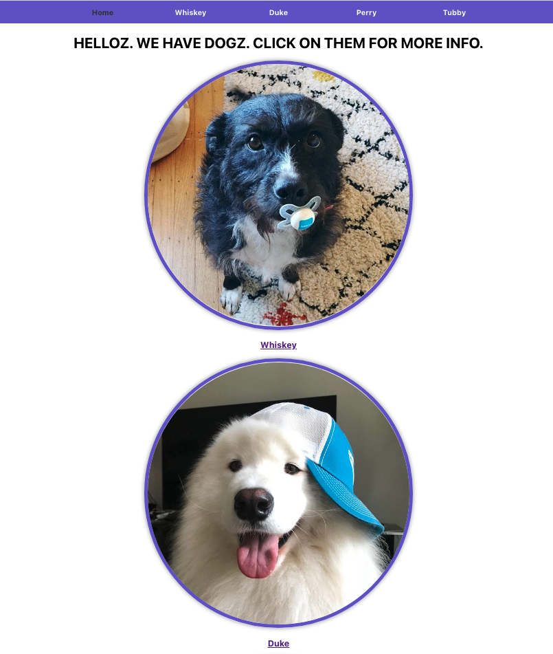

# Dog Finder App

This project was bootstrapped with [Create React App](https://github.com/facebook/create-react-app).

This app routes to different dogs and displays information on that dog when you’re at that route.  

The routes look like this:  **`/dogs`** is the homepage and shows all three dogs 

Clicking on a dog from the homepage takes you to that dog’s route. For example, clicking on Whiskey will take you to **`/dogs/whiskey`**.  

Every other endpoint not listed should redirect you to **`/dogs`**.

